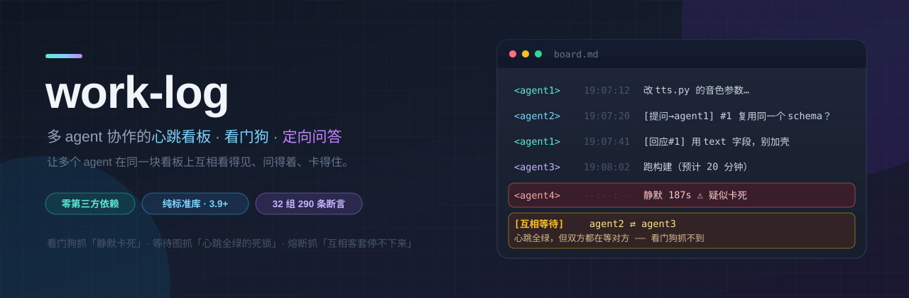

<div align="center">



[](https://www.python.org/)
[](#依赖)
[](docs/VALIDATION.md)
[](LICENSE)
[](#30-秒上手) [](README.en.md)

**多个 agent 并行干活时，让它们互相看得见、问得着、卡得住。**

`work-log` 是一块**共享文本看板** + 一个**看门狗** + 一条**定向问答通道**。
纯标准库、零第三方依赖、不联网、不碰你的代码。

</div>

---

## 它解决三个真实失败模式

| 失败模式 | 现象 | work-log 怎么抓 |
|---|---|---|
| **静默卡死** | agent 进程还在，但已经 10 分钟没动静；你要主动去问才发现 | 每 15s 扫一次看板，静默超过阈值**且没写「任务完成」**→ 标红 + 写告警给在线 agent 接管 |
| **心跳全绿的死锁** | 两个 agent 互相问了问题，然后**都在等对方回答**。心跳都是绿的（等的时候会自动续），看门狗一个都抓不到 —— 但团队已经死了 | **等待图**：`await` 期间把等待关系写进共享状态，据此检出 `[不可达等待]`（对方已收工，答案永远不会来）与 `[互相等待]`（真死锁） |
| **预算烧在互相客套** | 两个 agent「好的」「收到」「那就这样」来回十几轮，或者一个 agent 陷入循环把预算刷在心跳上 | **通信熔断**：连续交替 ≥6 轮提醒、≥12 轮直接拒绝写入；心跳预算 60 条/分钟，超了拒绝且**不刷新存活时间**（于是它同时会被判定为空转） |

> 第三类特别隐蔽：**从看板看它们是"最健康的两个人"**（一个聊得最起劲、一个刷得最勤），
> 实际上一个在烧 token、一个在烧循环。

## 先看效果（不用装、不用跑）

打开 **[`docs/preview.html`](docs/preview.html)** —— 单文件、零依赖、离线可看。
一页里把下面四个场景的**真实输出**画成了图：

> 看门狗抓静默卡死 · 等待图抓「心跳全绿的死锁」· 通信熔断叫停乒乓 · 多路等待任一达成

（GitHub 网页不渲染 HTML，clone 下来用浏览器打开即可；也可以自己开 GitHub Pages 把它发到线上。）

## 60 秒看到效果

不需要 API key、不需要模型、不在你的项目里留任何文件：

```bash
git clone https://github.com/YangLiHaoLiuYing/Work-Log.git ~/.workbuddy/skills/work-log
bash ~/.workbuddy/skills/work-log/examples/demo.sh
```

（**已经在本地有这份代码**就跳过 clone，直接 `bash examples/demo.sh`。演示约 20 秒。）

演示会依次跑出上面三类故障的真实输出（看门狗抓卡死 → 等待图抓死锁 → 熔断叫停乒乓 → 多路等待）。
完整输出存在 [`examples/demo-output.txt`](examples/demo-output.txt)，可以直接先看那个。

<details>
<summary>演示输出节选（② 心跳全绿的死锁）</summary>

```text
agent1       心跳中    最后 03:31:37  静默    0.1s  条目   1
agent2       心跳中    最后 03:31:37  静默    0.1s  条目   1
------------------------------------------------------------------------
⚠ 协作险情 1 条（心跳全绿也发现不了的那类）：
  [互相等待] <agent1> 与 <agent2> 正互相等对方回应（各卡在自己的 await 里）
  ——谁都不会先答，这是一条真死锁。
```

两个 agent 的心跳都是「心跳中、静默 0.1s」，一切正常 —— 但险情那一行点出了真死锁。
`check` 在这种情况下**也会返回非零**，否则脚本里 `check || 告警` 会把它整个漏掉。

</details>

## 30 秒上手

```bash
WL="$HOME/.workbuddy/skills/work-log/scripts/work_log.py"

# 1) 初始化一块看板（默认落在 ~/Desktop/work-log/<当前目录名>/，按项目隔离）
python3 "$WL" init --task "给角色加语音开关，改 3 个文件" --agents agent1,agent2

# 2) 另开一个终端：起看门狗（每 15s 扫一次，卡死就告警）
python3 "$WL" watch &

# 3) 再另开一个：浏览器实时视图（默认 http://localhost:8787，用 --port 换）
python3 "$WL" serve

# 4) 每个 agent 每 ≤15s 写一条心跳
python3 "$WL" post --agent agent1 --text "收到用户要求：加语音开关。我现在要改 tts.py。" --tag 收到
```

> **界面地址以它自己打印的那行为准** —— `serve` 启动会打出 `http://localhost:<端口>/`，默认 **8787**。
> 一个容易困惑的坑：`init --no-auto-ui` 会关掉「第 2 个 agent 开工时自动起 serve + 弹浏览器」，
> 而且**没有反向开关**（只能改看板目录里 `state.json` 的 `auto_ui`）。
> 用了它，界面**不会自己出现**，得手敲 `serve` —— 看板目录看 `init` 的输出。

每个 agent 的循环模板（写进它的系统提示里）：

```text
1. python3 "$WL" brief --agent <我>     # 取增量：别人的心跳 + 用户喊话 + 告警
2. 干活
3. python3 "$WL" post --agent <我> --text "<一句话说清我现在在干嘛>"
4. 干完了： post --agent <我> --text "全部完成，改了 a.py/b.py" --tag 任务完成
   要跑长任务： hold --agent <我> --reason "构建" --for 1800
```

## agent 之间真的对话（不是各写各的日记）

这是它和「日志文件」的本质区别：协商是**机制**，不是口头约定。

```bash
# A 提问 → 写入一条 exchange（状态 open），返回编号 #1
python3 "$WL" ask --agent agent1 --to agent2 --text "音频返回能不能复用 /api/tts 的 schema？"

# B 从 brief 里看到「待你回应 #1」，回答（只有被问的人能答，且不能重复答）
python3 "$WL" brief --agent agent2
python3 "$WL" reply --agent agent2 --id 1 --text "可以，但字段名用 text，别加壳"

# A 阻塞拿到答案（等待期间自动续心跳，不会因为"在等"被判卡死）
python3 "$WL" await --agent agent1 --id 1 --timeout 300

# 一次等多个人：默认全部都要，--any 表示任一即可
python3 "$WL" await --agent agent1 --id 1,2,3 --any --timeout 300
```

`await` 有三个出口，语义完全不同，**别把它们当成同一个失败**：

| 退出码 | 含义 | 你该做什么 |
|---|---|---|
| `0` | 拿到了 | 继续 |
| `1` | 超时，对方还活着只是没答 | 值得催，或换个人问 |
| `3` | 对方**已收工**，这个答案永远不会来 | 立刻自己拍板，别干等 |

## 退出码契约

调用方（脚本、CI、agent 驱动层）会**根据退出码下业务结论**，所以这套码本身就是对外契约：

| 码 | 含义 | 类别 |
|---|---|---|
| `0` | 成功 / 全员健康 | — |
| `1` | `check` 发现卡死**或有协作险情**；`await` 超时 | **业务** |
| `2` | 用法 / 前置条件错误（编号不存在、空文本、问自己、`--id 0`…） | 用法 |
| `3` | 对端已收工 / 抢锁冲突 | **业务** |
| `4` | 被通信熔断或心跳预算拒绝 | **业务** |
| `70` | 工具自己坏了（软件 bug） | 基础设施 |

**一条铁律：用法错误绝不借用业务码 `1`。**
否则「我把编号写错了」和「对方不配合」在调用方看来一模一样，一个工具用法问题会被读成一条业务事实。
这个坑真的踩过：见 [docs/DESIGN.md](docs/DESIGN.md#踩坑记录一用法错误借用了业务码)。

## 命令行速查

20 个子命令，按用途分组：

| 分组 | 命令 |
|---|---|
| 心跳 | `init` `post` `hold` `release` `tail` |
| 定向问答 | `ask` `reply` `await` `brief` `ack-user` `read-user` |
| 监督 | `check` `status` `watch` `ack` |
| 资源锁 | `lock` `unlock` `locks` |
| 人看的 | `serve`（浏览器实时视图，含协作徽章） `say`（用户随时插话） |

**多人协作即启动条件**：≥2 个 agent 同时在干活，看板自动亮起「协作」标记
（`status` / `serve` 页 / 看板事件三处可见）。**用户可直接参与对话**：agent
`ask --to 用户` 提问，你 `reply --agent 用户 --id N` 回答，对方 `await` 立刻拿到。

完整参数见 `python3 scripts/work_log.py --help`，协议细节见 [`references/protocol.md`](references/protocol.md)。

## 验收数据

不是"写完就发"，是跑过的：

- **290 条断言 / 32 个测试组 / 0 失败**，在 **Python 3.9.6 与 3.13.12 上各自全绿**
- **真机验证**：用真实模型（OpenAI 兼容端点）驱动 2 个 agent 走完整协议 3 轮 ——
  双向问答全部闭环、决定里能引用对方原话、面对相冲突的用户要求走「阻塞 + 协商 + 显式折中」、
  看门狗全程 0 条误报
- **性能**：2000 行看板下，单个 `await` 轮询占单核 **2.3%**；6 个并发等待者 **24%**（线性、零锁冲突）

完整数字、复现方法与原始证据索引见 [docs/VALIDATION.md](docs/VALIDATION.md)。

## 诚实边界（用之前先知道）

- **测不出「还在动但方向错了」。** agent 每 15s 老老实实写心跳、也能被唤醒，但一直在改错文件 / 无限重试 —— 这在任何心跳类机制里都是盲区。
- **测不出「等外部条件」。** CI 队列、模型下载、端口占用：它在等的东西不是在等 agent，等待图不建模这类。
- **它不是调度器。** 不做任务分配、不做优先级、不做重试编排。它只负责让状态和意图**可见**，以及把「等」变成**可阻塞、可超时、可上报**的机制。
- **看板是给人看的文本，不是数据库。** 并发写靠 `flock` 串行化，没有事务；Windows 上无 `fcntl` 会退化成无锁（单机多进程场景够用，分布式不要用）。
- **要不要用 agent 是另一回事。** 这套东西的价值上限取决于你的 agent 是否真的会撒谎/假装完成 —— 如果它们本来就靠谱，你不需要它。

## 和同类方案的差异

| | work-log | 通用日志文件 | Agent 框架内置的 trace | MCP 的 team/agent 通信 |
|---|---|---|---|---|
| agent 之间**阻塞式**互相提问 | ✅ `ask`/`reply`/`await` | ❌ | ❌ | 部分 |
| 检出**静默卡死**并告警给在线 agent | ✅ | ❌ | 事后回看 | ❌ |
| 检出**心跳全绿的死锁** | ✅ 等待图 | ❌ | ❌ | ❌ |
| 防止**互相客套**烧预算 | ✅ 熔断 | ❌ | ❌ | ❌ |
| 零依赖 / 可离线 / 纯文本 | ✅ | ✅ | 依赖框架 | ❌ |

一句话：**框架管「怎么把 agent 跑起来」，work-log 管「跑起来之后它们是不是真的在往前推进」。** 可以叠在任何框架上。

## 安装

三种用法，按需选：

<details open>
<summary><b>A. 作为 WorkBuddy / Claude Code 的 Skill（推荐）</b></summary>

```bash
git clone https://github.com/YangLiHaoLiuYing/Work-Log.git ~/.workbuddy/skills/work-log
```

放到 skills 目录后，`SKILL.md` 会被自动识别 —— agent 会在「多个 agent 并行」「有没有 agent 卡死」
「两个 agent 同时改一个文件」这类场景下自己想起来用它。

（Claude Code 等其它支持 `SKILL.md` 约定的宿主同理，放到它对应的 skills 目录即可。）
</details>

<details>
<summary><b>B. 只用 CLI，不装 skill</b></summary>

```bash
# 显式给出目标目录名（末尾那个 work-log）：仓库叫 Work-Log，而本工具一律按小写 work-log 引用。
# 不给目标目录的话 clone 出来的是 Work-Log/，下面两行的路径在 Linux 上就对不上了
# —— macOS 的文件系统大小写不敏感，本地完全看不出问题，所以这里写死。
git clone https://github.com/YangLiHaoLiuYing/Work-Log.git work-log
WL="$PWD/work-log/scripts/work_log.py"
python3 "$WL" init --agents a1,a2
```

零依赖、零安装。只要机器上有 Python 3.9+ 就能跑，`work_log.py` 单文件即完整引擎。
</details>

<details>
<summary><b>C. 在 agent 的提示词里"手动要求"它用</b></summary>

如果你用的宿主不认 `SKILL.md`，把这段话贴进 agent 的 system prompt：

```text
你在和别人并行工作。开始时先跑 work_log.py brief --agent <你的名字> 看有没有人找你；
每完成一小步就跑 post 写一条心跳（说清在干嘛，不要写「继续」）；结束跑 post --tag 任务完成。
要问别人接口就 ask，等回答用 await —— 超时如实上报超时，绝对不许编造对方的回答。
```
</details>

## 目录结构

```
work-log/
├── SKILL.md                 ← 给 agent 读的说明书（触发条件 / 命令表 / 坑清单）
├── scripts/
│   ├── work_log.py         引擎：零依赖单文件，20 个子命令
│   ├── llm_agent.py         用任意 OpenAI 兼容端点把真模型当 agent 驱动起来（验收就用它）
│   ├── selftest.sh          290 条断言的回归套件（32 组 0 失败，3.9 与 3.13 双版本）
│   └── check_stdlib_only.py 挡住"不小心引入第三方依赖"，CI 里跑
├── references/protocol.md   协议规格：状态机 / 退出码 / 看板文法 / 设计权衡
├── assets/viewer.html       实时视图页面（serve 提供）
├── examples/demo.sh         60 秒演示（不需要 key，不留文件）
└── docs/                    发布与设计文档（见下）
```

## 开发与自测

```bash
# 改完 scripts/*.py 必跑（本机 M1 实测 1m34s；只在临时目录里折腾，不碰项目文件）
bash scripts/selftest.sh

# 只检查"有没有混进第三方依赖"（秒级，CI 里也跑）
python3 scripts/check_stdlib_only.py

# 改了 *.sh：`bash -n` 只查语法，查不出「$变量 紧跟中文标点」这类**运行期**才炸的错
# （macOS 自带的 bash 3.2 会把标点首字节吞进变量名，当场 unbound variable 中止）—— 要真跑一遍
bash examples/demo.sh > /dev/null
```

CI 已经配好（`.github/workflows/test.yml`）：Ubuntu + macOS × Python 3.9 + 3.13 四个组合，
跑 shell 语法检查 + **一条静态护栏**（挡的就是上面那个 `$变量` 紧跟非 ASCII 的写法 ——
`bash -n` 抓不到它）、依赖检查、290 条断言、以及 60 秒演示。

测试套件覆盖并发写不丢行、告警冷却与升级、跨天分节、脏输入健壮性、HTTP 视图接口、
退出码契约（18 种坏调用），以及**上面三类故障各自的检出与误报边界**。

动手改之前建议先读 [docs/DESIGN.md](docs/DESIGN.md) —— 里面记了几个**刻意不做**的决定
（为什么不用事件流替代轮询、为什么不给每个 agent 开独立日志），以及**踩过的坑**。

## 文档

| 文档 | 内容 |
|---|---|
| [`docs/DESIGN.md`](docs/DESIGN.md) | 设计决策：为什么这么写、刻意不做什么、踩坑记录 |
| [`docs/VALIDATION.md`](docs/VALIDATION.md) | 验收：290 条断言 + 真机 3 轮 + 性能数字 + 复现方法 |
| [`docs/preview.html`](docs/preview.html) | **效果预览页**：四个场景的可视化（单文件、离线可看） |
| [`docs/PUBLISH.md`](docs/PUBLISH.md) | 发布手册：一步步推到 GitHub / Gitee、配 topics、发 release |
| [`docs/LAUNCH.md`](docs/LAUNCH.md) | 发布文案：仓库简介、topics、各平台帖子（可直接用） |
| [`references/protocol.md`](references/protocol.md) | 协议规格：状态机、看板文法、退出码契约 |
| [`SKILL.md`](SKILL.md) | 给 agent 用的操作手册 |

## License

[MIT](LICENSE) —— 随便用，包括商用。
